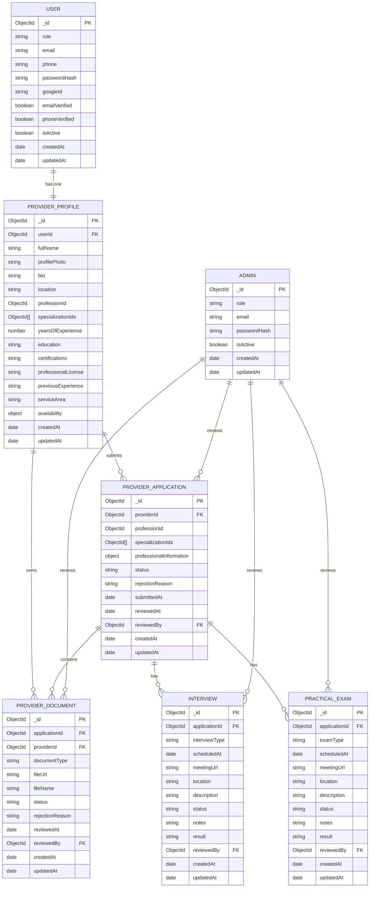

# TabibiGo — Provider Authentication & Verification ERD

> **Scope:** This diagram covers the full entity relationship model for the Provider Authentication and Verification domain.
> It includes all entities involved in the provider onboarding pipeline, from user account creation through admin review.

---

## Entity Relationship Diagram

---

## Relationship Summary

| Relationship | Cardinality | Foreign Key | Purpose |
|---|---|---|---|
| USER → PROVIDER_PROFILE | 1 : 1 | `PROVIDER_PROFILE.userId → USER._id` | Links a user account to its provider professional profile |
| PROVIDER_PROFILE → PROVIDER_APPLICATION | 1 : N | `PROVIDER_APPLICATION.providerId → PROVIDER_PROFILE._id` | A provider can submit multiple verification applications over time |
| PROVIDER_PROFILE → PROVIDER_DOCUMENT | 1 : N | `PROVIDER_DOCUMENT.providerId → PROVIDER_PROFILE._id` | A provider owns all documents they have ever submitted |
| PROVIDER_APPLICATION → PROVIDER_DOCUMENT | 1 : N | `PROVIDER_DOCUMENT.applicationId → PROVIDER_APPLICATION._id` | Each document is attached to a specific application |
| PROVIDER_APPLICATION → INTERVIEW | 1 : N | `INTERVIEW.applicationId → PROVIDER_APPLICATION._id` | An application may generate multiple interview records |
| PROVIDER_APPLICATION → PRACTICAL_EXAM | 1 : N | `PRACTICAL_EXAM.applicationId → PROVIDER_APPLICATION._id` | An application may generate multiple practical exam records |
| ADMIN → PROVIDER_APPLICATION | 1 : N | `PROVIDER_APPLICATION.reviewedBy → ADMIN._id` | Tracks which admin reviewed an application |
| ADMIN → PROVIDER_DOCUMENT | 1 : N | `PROVIDER_DOCUMENT.reviewedBy → ADMIN._id` | Tracks which admin reviewed a specific document |
| ADMIN → INTERVIEW | 1 : N | `INTERVIEW.reviewedBy → ADMIN._id` | Tracks which admin managed the interview |
| ADMIN → PRACTICAL_EXAM | 1 : N | `PRACTICAL_EXAM.reviewedBy → ADMIN._id` | Tracks which admin managed the practical exam |
